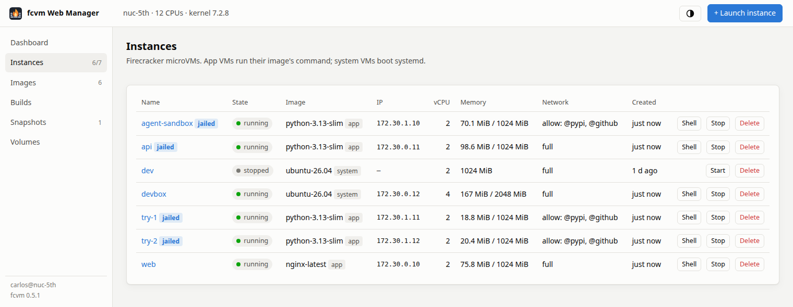
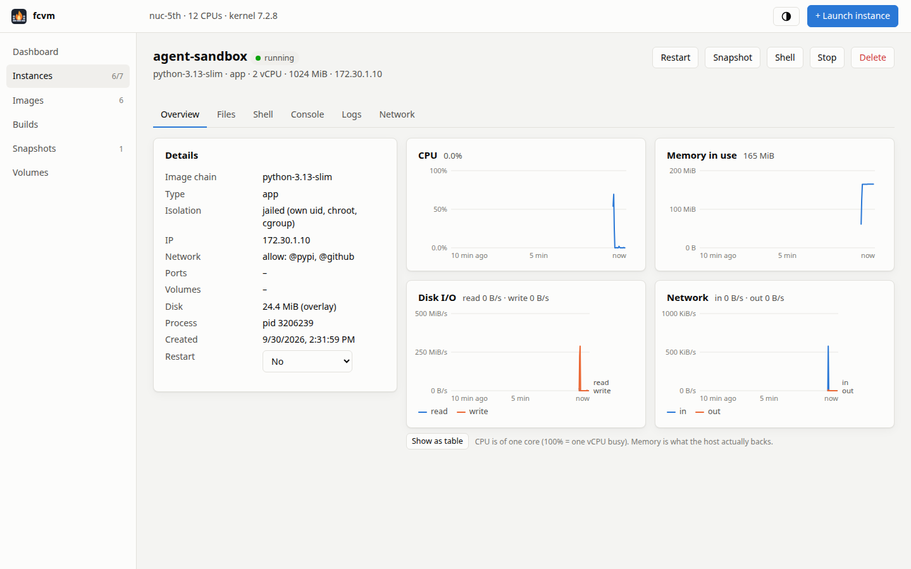

# Web console

```sh
fcvm serve            # prints http://127.0.0.1:8686/?token=...  (open it in a browser)
```

With the [fcvm service](service.md) installed, the console is always
running. `fcvm service status` prints its URL.



A cloud-console-like UI for this host:
- **Dashboard:** host CPU, memory and disk; VM memory actually in use vs
  allocated; network slots; running instances with their CPU and memory.
- **Instances:** start, stop, restart, delete, snapshot, commit to image.
  Each instance page has details, the restart policy, logs, and the egress
  policy with its allow/deny log, and:
  - charts from the host (CPU, memory, disk I/O, network) and from inside
    the guest (CPU, memory used, root disk used, load), over 10 minutes,
    1 hour, 6 hours or 24 hours, each with a table view (see
    [Metrics](#metrics));
  - a **Processes** tab: the guest's processes with their user, CPU,
    memory, state and command, like `top`. fcvm's own process in the guest
    is labelled, and kernel threads are hidden unless you ask.
- **Browser terminals:** a **Shell** tab (an interactive shell through the
  exec agent, optionally as another user) and a **Console** tab (the live
  serial console).
- **Launch:**
  - name, image, vCPUs and memory;
  - network: full, an allowlist built from presets and extra hosts, or
    none;
  - published ports, volumes and host directories;
  - for app images: run the image's command, stay idle for the shell, or
    run a custom command;
  - a restart policy, and the jailer (checked by default when installed);
  - a template picker that fills in the form, and **Save as template**.
- **Templates:** saved launch recipes, built-in and yours: launch, delete
  ([Templates](templates.md)).
- **Images:** import from a registry or a local archive (a background job
  with progress), launch from an image, delete.
- **Files** (instance tab):
  - browse the VM's filesystem, upload (with progress), download, edit
    text files in place, create folders, rename, delete;
  - add or remove host directories, live on a running VM;
  - it works in any image, even without a shell;
  - writes are atomic, and edited files keep their owner and mode.
- **Builds:**
  - projects from a template (Python, Alpine, Ubuntu or blank), or an
    existing directory on the host;
  - edit the Dockerfile and files in the browser, or upload files and
    folders;
  - build with a name, build args, a network policy and no-cache, while the
    log streams live beside a step list that shows cached steps;
  - "Launch it" opens the launch dialog on the result.
- **Snapshots:** fork, delete. **Volumes:** list, delete.



Light and dark themes follow your OS, with a toggle. Everything works
offline: xterm.js is vendored, and there's no build step or CDN.

## Metrics

The console samples every running VM every 2 seconds from the host (the
Firecracker process's CPU, memory and I/O, and its network traffic), and
every 10 seconds from inside the guest, through the exec agent: CPU, memory,
root disk, load and processes, as the guest sees them. That works in any
image, with nothing installed in it.

- **History.** The last 10 minutes are kept at full resolution. Every
  minute is also averaged into one point, kept for 24 hours in
  `metrics/` in fcvm's state directory, so the longer views survive
  restarts of the console and of the host.
- **Guest CPU** counts one busy vCPU as 100%, like the host-side chart, so
  a 2-vCPU VM can reach 200%.
- **VMs started before fcvm 0.6.0** show guest metrics after a restart,
  which gives them the new init.

**Prometheus.** `GET /metrics` serves the latest values in the Prometheus
text format, with the same bearer token as the API: host CPU and memory,
VMs by state, and per VM `fcvm_vm_up`, memory, CPU seconds, disk and
network byte counters, and the `fcvm_guest_*` gauges from inside the guest.
A scrape job:

```yaml
scrape_configs:
  - job_name: fcvm
    authorization: { credentials: "TOKEN" }     # fcvm service status prints it
    static_configs: [{ targets: ["127.0.0.1:8686"] }]
```

## Security

- **Local only.** It binds `127.0.0.1` only.
- **Token.** The printed URL carries a token, which the browser exchanges
  for an HttpOnly, SameSite=Strict cookie. A plain `fcvm serve` makes a new
  token on every start; the service keeps one.
- **Request checks.** Requests must carry a localhost `Host` header, which
  blocks DNS rebinding. Changes and terminals need a same-origin `Origin`,
  which blocks cross-site requests.
- **Content-Security-Policy.** A strict policy allows only the app's own
  scripts.
- **Treat the URL like a password.** The browser shell is a root shell in
  your VMs. Remote access with real accounts is
  [on the roadmap](roadmap.md#web-console).

To reach the console from another machine today, use an SSH tunnel:
`ssh -L 8686:127.0.0.1:8686 yourhost`.

## Scripting

The console is a client of fcvm's [HTTP API](api.md). Scripts can use the
same API with the token as a bearer token.

How the server is built is in
[How it works](internals.md#the-web-console).
